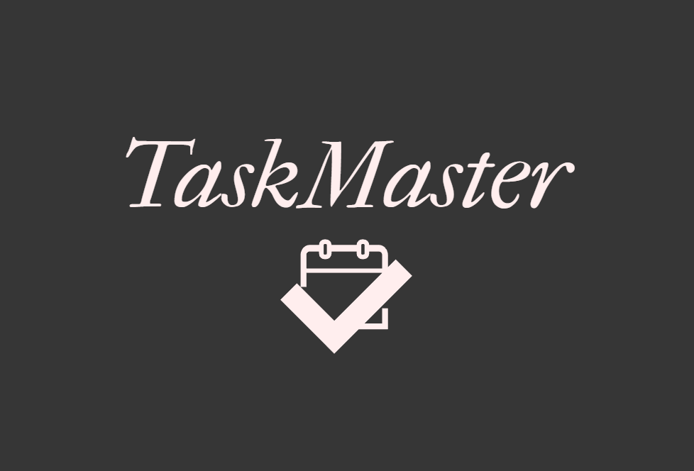

# Application de liste de tâches Python

[](https://github.com/AndreaLM06/todo-list-python/blob/main/README.md)
[](https://github.com/AndreaLM06/todo-list-python/blob/main/LICENSE)


Il s'agit d'une application simple de liste de tâches écrite en Python en utilisant la bibliothèque PySide6.
L'application vous permet d'ajouter, de modifier et de supprimer des tâches, ainsi que de les filtrer et de les trier en
fonction de divers critères.



---

## Table des matières

- [Fonctionnalités](#fonctionnalités)
- [Installation](#installation)
- [Création d'un exécutable](#création-dun-exécutable)
- [Exécution de l'application](#exécution-de-lapplication)
- [Structure de l'application](#structure-de-lapplication)
- [Contribution](#contribution)
- [License](#license)

---

## Fonctionnalités

1. [x] Ajouter des tâches avec un titre, une description, une date de début, une date de fin et un indicateur d'urgence
   facultatif.
2. [x] Modifier les tâches existantes
3. [x] Supprimer des tâches des listes À faire ou Terminé
4. [x] Double-cliquer sur les tâches dans la liste À faire pour les marquer comme Terminé
5. [x] Filtrer les tâches par dates d'échéance à venir
6. [x] Trier les tâches par date de début ou date de fin

---

## Installation

### Installer Node JS

[](https://nodejs.org/en/download/current/)

### Installer Python

[](https://www.python.org/downloads/)

### Installer les dépendances

Avant d'exécuter l'application, assurez-vous d'installer les dépendances requises. Vous pouvez le faire en exécutant la
commande suivante :

```bash
pip install -r requirements.txt
```

---

## Création d'un exécutable

Pour créer un exécutable de l'application de la liste de tâches, suivez ces étapes :

#### Exécutez la commande suivante pour créer un exécutable :

```bash
pyinstaller --onefile --windowed --icon=images/todo_list.ico src/main.py
```

---

## Exécution de l'application

Pour exécuter l'application, exécutez simplement le fichier main.py :

```bash
python main.py
```

---

## Application Structure

Le projet est organisé comme suit :

- `main.py` : Il s'agit du point d'entrée de l'application. Il initialise et exécute la fenêtre principale.
- `todo_list.py` : Ce fichier contient la classe TodoApp, qui gère la logique et l'interface utilisateur de l'
  application.
- `requirements.txt` : Ce fichier répertorie les packages Python requis pour l'application.

---

## Contribution

Si vous souhaitez contribuer à ce projet, n'hésitez pas à soumettre une demande de fusion (pull request) ou à ouvrir un
ticket (issue) sur GitHub.

---

## License

Ce projet est publié sous la licence MIT. Consultez le fichier [LICENSE](./LICENSE) pour plus de détails.
